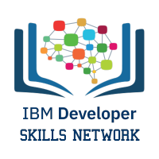

# Data Scientist Professional learning path - IBM Cognitive Class (Coursera)

## Intro
Data Science has been ranked as one of the hottest professions and the demand for data practitioners is booming. This Professional Certificate from IBM is intended for anyone interested in developing skills and experience to pursue a career in Data Science or Machine Learning.

## Topics covered
This program consists of 9 courses providing with latest job-ready skills and techniques covering a wide array of data science topics including: open source tools and libraries, methodologies, Python, databases, SQL, data visualization, data analysis, and machine learning. 

**Tools**: Jupyter / JupyterLab, Zeppelin notebooks, R Studio, and Watson Studio

**Libraries**: Pandas, NumPy, Matplotlib, Seaborn, Folium, ipython-sql, Scikit-learn, ScipPy, etc.

**Projects**: random album generator, predict housing prices, best classifier model, battle of neighborhoods

## My certificates
`Tools for Data Science` : <https://www.coursera.org/account/accomplishments/certificate/5TCVPTR8ZK9W>

`Python for Data Science and AI` : <https://www.coursera.org/account/accomplishments/certificate/Z8FUHNG5LFPC>

`Data Science Methodology` : <https://www.coursera.org/account/accomplishments/certificate/UD5UGTX76MJV>

`What is Data Science ?` : <https://www.coursera.org/account/accomplishments/certificate/PZCEBT7HV6ST>

`Databases and SQL for Data Science` : <https://www.coursera.org/account/accomplishments/certificate/HNKJQJFUDR6P>

`Data Analysis with Python` : <https://www.coursera.org/account/accomplishments/certificate/YHP9YW8QPNW5>

`Data Visualization with Python` : <https://www.coursera.org/account/accomplishments/certificate/J9CSL2DQQGUN>

`Machine Learning with Python` : <https://www.coursera.org/account/accomplishments/certificate/AU97Q96YZG9V>

## References
`Data Science Professional Certificate - IBM` : <https://www.coursera.org/professional-certificates/ibm-data-science>
